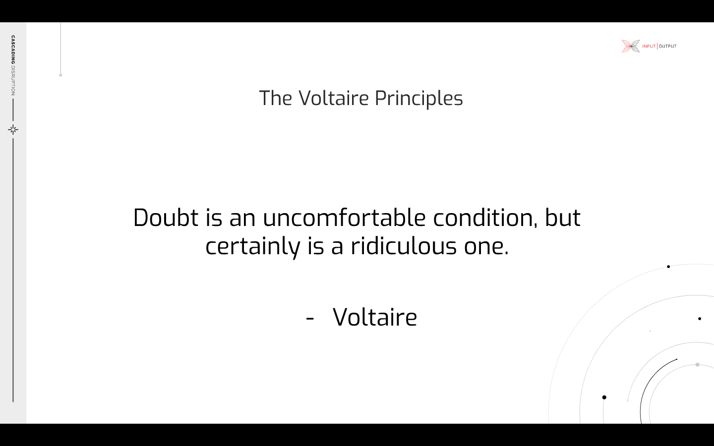

# The Voltaire Principles

At the Fund 7 Catalyst Town hall #5 on 8th December 2021 Dor Garbash gave a presentation entitled _The Voltaire Principles_ on the likely direction for success criteria of any transition to decentralized governance.

## Recording


Voltaire - Sneak preview with Dor Garbash


## Slides



### The Voltaire Principles

### Technical Councils

.png>)

### Our goal: An antifragile governance system

.png>)

### What keeps us antifragile?

.png>)

### Iterative & gradual transition

.png>)

### Effective decision making

.png>)

### Antifragile principles

.png>)

### Goal of the community governance oversight

.png>)

### Overcome our own shadows

.png>)
