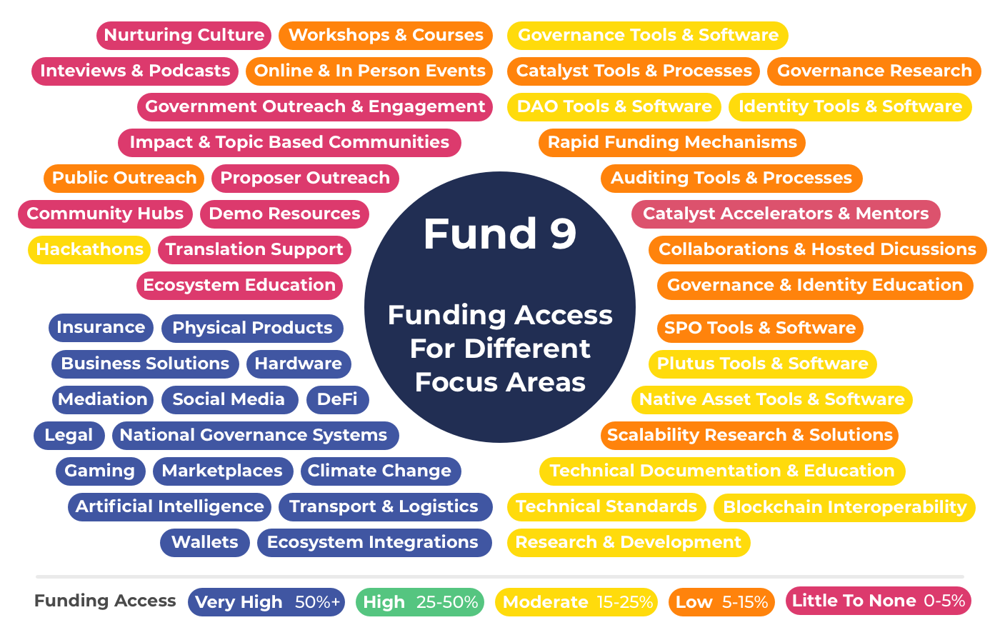

# Fund 8 Challenge Setting Report

## Issues that were identified

[Assessment approach for challenges needs improvement](https://docs.catalystcontributors.org/funding-categorisation-analysis/challenge-settings/challenge-setting-assessment-issues) - The information for challenge assessment guidance is limited and is of low quality. As one example, assessments penalize proposals that do not have a fully formed challenge team at the point of submission even though the team can be formed at any stage after they are voted in.

[Duplicated challenge settings](https://docs.google.com/spreadsheets/d/15ELXp81NfvXHgrerTbuIofZOXBsdjocN1YgBK0gPP3E/edit#gid=894583832) - Products & Integrations was copied into a separate proposal called DApps, Products & Integrations. This increased complexity for the voters in how they should vote to get their desired outcome. Duplicated categorisations lead to potential situations where neither challenge gets funded or both do. In this instance both got funded and the categorisations got merged.

[Overlapping categorisations](https://docs.catalystcontributors.org/funding-categorisation-analysis/historical-analysis-and-comparisons/categorisation-setting-observations/fund-8) - Overlapping categorisations add complexity for proposers when submitting proposals as they must decide between multiple categorisations. Voters have higher complexity when similar proposals are submitted in separate categorisations.

## Observations

[Little to no funding access for some focus areas](https://docs.catalystcontributors.org/funding-categorisation-analysis/historical-analysis-and-comparisons/funding-access-for-each-focus-area/fund-9) - Community & outreach and Catalyst focussed proposals saw either little or no access to funding for fund 9.

[Overlapping categorisations](https://docs.catalystcontributors.org/funding-categorisation-analysis/historical-analysis-and-comparisons/categorisation-setting-observations/fund-8) - Examples include 14 overlapping product & integration categorisations, 12 overlapping outreach categorisations, 12 overlapping community categorisations and 9 overlapping Catalyst categorisations amongst others

[19 broad categorisations and 53 specific categorisations were submitted](https://docs.catalystcontributors.org/funding-categorisation-analysis/historical-analysis-and-comparisons/categorisation-setting-observations/fund-8)

Data & statistics

|                                               | Fund 7       | Fund 8                   |
| --------------------------------------------- | ------------ | ------------------------ |
| Number of challenges proposed                 | 67           | 76                       |
| Number of challenges funded                   | 22           | 12 (11 after two merged) |
| Highest upvote ADA amount on a challenge      | ₳222,760,136 | ₳175,986,427             |
| Highest number of wallet votes on a challenge | 1321         | 1190                     |

## Funding categories as an alternative

Analysis has continued on funding categories as an alternative approach to funding categorisation - https://docs.catalystcontributors.org/funding-categorisation-analysis/

### [Access to funding for different focus areas](https://docs.catalystcontributors.org/funding-categorisation-analysis/historical-analysis-and-comparisons/funding-access-for-each-focus-area/fund-9)

Fund 8 challenge settings led to selected categorisations for fund 9 that had very high funding access for some areas compared over other focus areas.

Funding categories could achieve similar or better outcomes in most cases with a simpler approach. A similar outcome would be achieved with the following weightings:

* Community & Outreach - 5%
* Products & Integrations - 70%
* Governance & Identity - 10%
* Development & Infrastructure - 15%

### [Cost comparison](https://docs.catalystcontributors.org/funding-categorisation-analysis/historical-analysis-and-comparisons/categorisation-overall-cost-comparison)

Funding categories could have reduced the total overall cost by 90% for handling funding categorisation for fund 8 if it was fully used as an alternative approach. The [methodology ](https://docs.catalystcontributors.org/funding-categorisation-analysis/historical-analysis-and-comparisons/categorisation-overall-cost-comparison/methodology-and-data)for this cost comparison is documented.

### [Funding categorisation properties](https://docs.catalystcontributors.org/funding-categorisation-analysis/categorisation-properties/broad-vs-specific-categorisation)&#x20;

Categorisation properties were defined and helped to determine which properties are desirable for funding categorisation. Funding categories apply the more effective properties by being broad, inclusive and recurring.&#x20;

### [Funding categories advantages over challenge settings ](https://docs.catalystcontributors.org/funding-categorisation-analysis/funding-categories-advantages/overview)

Funding categories applying more effective categorisation properties means funding categories are more efficient, simple, flexible, scalable, egalitarian and good for effectively directing funding and promoting healthy competition.
