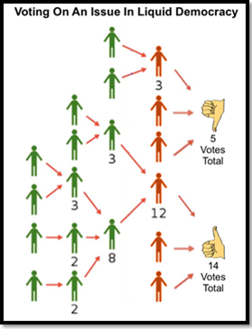
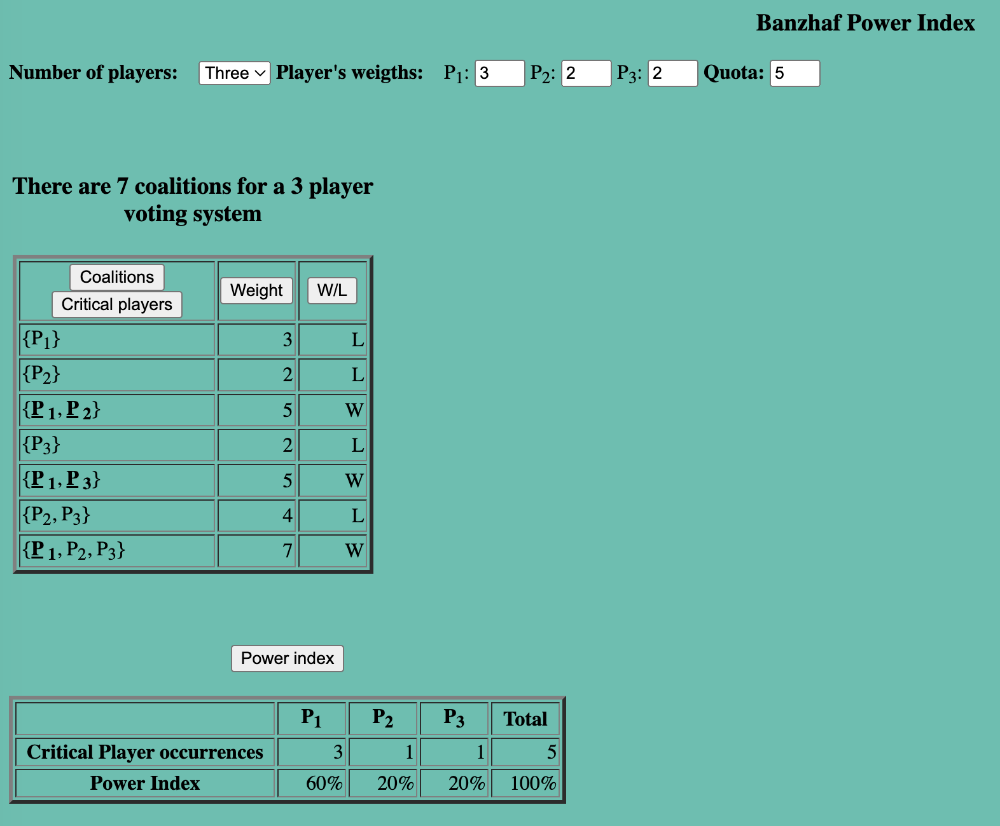
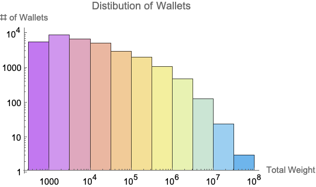
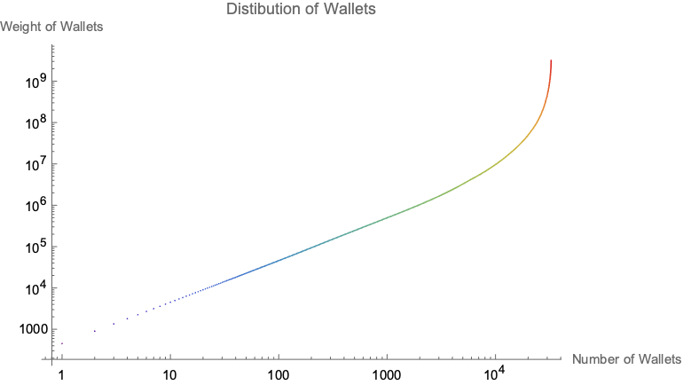
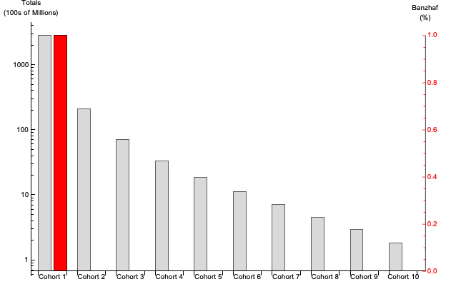
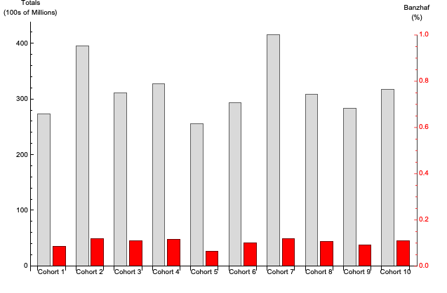
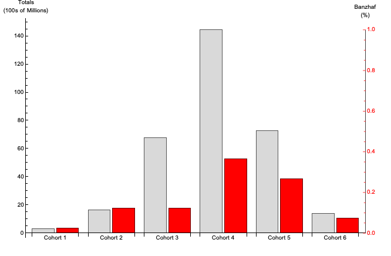
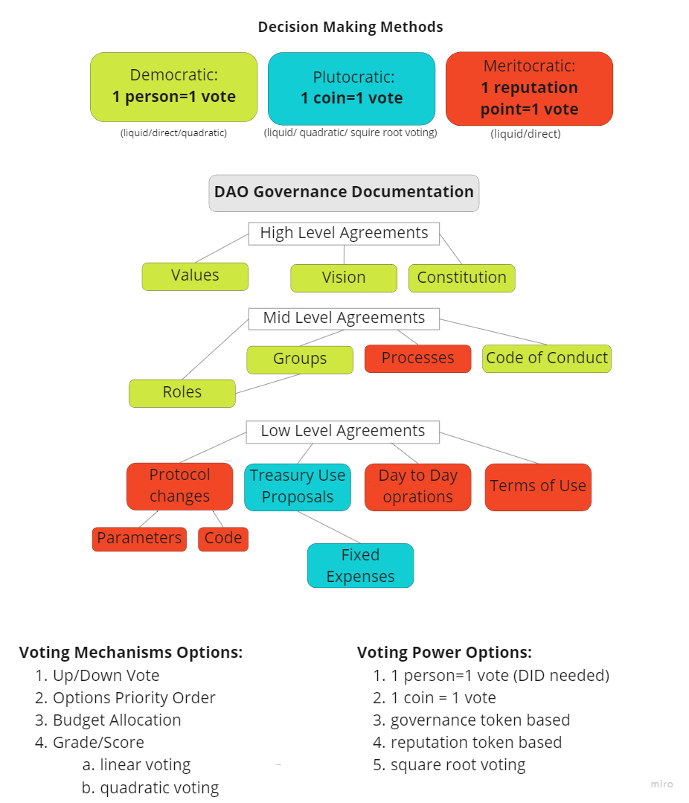

# Catalyst dRep Review

Delegated Representation in Cardano’s Project Catalyst Governance

A Review to support Community Governance Oversight

**Editors: Kenric P. Nelson, Thorsten Pottebaum,**\
**Stephen Whitenstall**\
**Contact Editor: kenric.nelson@photrek.io**\

July 2022

### &#x20;

### &#x20;

### TABLE OF CONTENTS 

1. Introduction\
   _Kenric P. Nelson, Thorsten Pottebaum, Stephen Whitenstall_
2. The role of Delegated Representation in Blockchain Governance\
   _Philip Lazos_
3. Measuring Voting Power in a Delegated Representative Process\
   _Steph Macurdy, Jesus Hernandez, Seth Chandler, Kenric Nelson_
4. Forming consensus in governance documentation\
   _Aharon Porath, Omer Tzuk, Kenric Nelson_

“Liquid Democracy is a technologically enabled and scalable hybrid of direct and representative democracy. It enables voters – to the extent they desire – to vote for themselves on some or all issues, or to delegate their vote to whom they choose.”

– Jim Rutt, [An Introduction to Liquid Democracy](https://medium.com/@memetic007/liquid-democracy-9cf7a4cb7f)

### INTRODUCTION 

#### Kenric P. Nelson, Thorsten Pottebaum, and Stephen Whitenstall Contact: kenric.nelson@photrek.io 

[Project Catalyst](https://cardano.ideascale.com/c/landing) is an [experiment in community engagement](https://cardanocataly.st/) that is charged with developing the Cardano blockchain ecosystem [\[1\], \[2\]](https://www.zotero.org/google-docs/?d9CJgk) through the funding of research, development, adoption, and maintenance projects. Project Catalyst is funded by the [Cardano Treasury](https://quality-assurance-dao.gitbook.io/community-governance-oversight/parameters/governance-parameters/cardano-treasury-with-kevin-hammond#how-is-the-treasury-funded) which receives incremental funding each epoch (5 days) from monetary expansion from the Cardano reserves and from network transaction fees. The inflation rate decreases exponentially over a 30 year period at which point the transaction fees will solely fund the treasury. As of September 2022, Catalyst has funded eight rounds of projects totaling $25.6 million in awards. Additionally, community members receive rewards for administrative functions such as overseeing a challenge topic and reviewing proposals. While Catalyst is often referred to as a Decentralized Autonomous Organization (DAO), a more accurate description may be a Decentralized Innovation Fund. The fund is currently administered by Input Output Global (IOG) using innovative mechanisms to develop the communities ability to self-administer the fund. Central to the communities engagement with the fund is one coin one voting for approval and funding of projects.

Several initiatives under the roadmap phase [Voltaire](https://roadmap.cardano.org/en/voltaire/) are underway to further decentralize the governance of Catalyst. One such initiative is the establishment of [Delegated Representatives (dReps)](https://iohk.io/en/blog/posts/2022/04/11/introducing-the-concept-of-delegate-representatives-dreps/), who will be public representatives voting on projects on behalf of the ADA holders who choose to delegate their vote to them. The dReps program will utilize liquid democracy [\[3\]–\[7\]](https://www.zotero.org/google-docs/?eC678V), shown in Figure 1, that allows voters to either vote directly for proposals or to delegate their vote to a representative. The initial implementation of dReps will only use one-layer of liquid democracy in which the dReps cannot further delegate their vote. The purpose of the dReps program is to increase the participation of ADA holders in the Catalyst voting process and to develop a group of experts to carefully evaluate projects. Since the analysis of and voting on projects is time-consuming, the ability to delegate this responsibility is anticipated to increase passive participation.

_**Figure 1.** Liquid Democracy. Voters have the option to vote directly (orange) or to delegate to a representative (green). Shown is a multilayer process in which representatives can delegate to another representative. Source:_ [_An Introduction to Liquid Democracy_](https://medium.com/@memetic007/liquid-democracy-9cf7a4cb7f)

The purpose of this review paper is to provide the Catalyst community with analysis of the opportunities and potential pitfalls of the dReps process. The scope of Project Catalyst and the complexities of a liquid democracy process are such that this initial analysis is necessarily limited in scope. In “_The role of Delegated Representation in Blockchain Governance_” Philip Lazos, Research Fellow at IOG, provides a literature review on liquid democracy. Lazos examines the merits of liquid democracy through evaluation of the influence of abstaining, measures of objective quality in outcomes, and the process of selecting delegates. In “_Measuring Voting Power in a Weighted Voting System_” Stephen Macurdy, Blockchain Analyst at Wolfram Research leads a team using the Wolfram Language to measure the voting power of participants in Project Catalyst. A mathematical definition of voting power is introduced and applied to analysis of prior rounds of Catalyst voting. In “_Forming consensus in governance documentation_” Aharon Paroth, Founder of Consenz, leads a team examining the use of collaborative writing tools to author agreements. The section describes the capabilities of the Consenz system to facilitate co-authors in voting to approve suggested edits to an agreement.

### The role of Delegated Representation in Blockchain Governance  

#### Author(s): Philip Lazos Contact: philip.lazos@iohk.io 

Even though Liquid Democracy has intrigued economists and political scientists for years, its real world applications have been sparse. However, the emergence of blockchain systems with sophisticated governance platforms has accelerated its adoption: either as one-step delegation (also known as proxy voting) or full liquid democracy solutions are hotly debated and developed. The goal is to increase the ‘quality’ of the selected outcome, without requiring that all voters have the expertise (or time) to put the effort into every alternative, which can often be highly technical.

The current literature on delegation can present a confusing image: there is a growing number of papers both in favor and against liquid democracy. This might appear contradictory at first glance, but the devil is in the details. To fully grasp the current landscape, a careful study of each model is necessary. Specifically, it is crucially important to determine:

* Why are the voters abstaining?
  * Is it random?
  * Is information acquisition too expensive?
  * How corruption-resistant and safe is the voting system? Are there malicious voters (i.e., exogenously motivated who do not care about the health of the platform) that will never abstain?
* Is there an objective quality of the outcome, or is it a matter of approval?
  * A software update improving the netcode of a node could be objectively rated based on its performance after adoption. A different ‘monetary’ policy (e.g. regarding coin inflation) is a more political decision.
* How are the delegates selected?
  * Is there a restriction based on the social network of every user?
  * Is it easy to determine which delegate is closest to a user’s true profile?

To illustrate the different modeling assumptions, we begin by providing a short exposition of two prominent papers: “_Liquid Democracy: An Algorithmic Perspective_” [\[8\]](https://www.zotero.org/google-docs/?xm2AXH), by Kahng Mackenzie and Procaccia and “_Proxy Voting for Better Outcomes_” by Cohensius, et al. [\[4\]](https://www.zotero.org/google-docs/?AcHtOF).

In “_Liquid Democracy: An Algorithmic Perspective_”, the vote only presents two alternatives, only one of which is considered ‘good’. This is called the _epistemic_ setting, which is different from the usual voting scenarios that have no notion of universally ‘good’ outcome, as every voter has their own preferences. Each voter is described by a number , which encodes the probability that voter _i_ will vote for the ‘good’ outcome. Moreover, these voters have a social relationship represented by a graph (essentially a list containing pairs of voters that know each other). Given a delegation mechanism, the objective here is to maximize the _probability_ that the ‘good’ outcome is actually selected. For example, suppose we have a setting with two voters with π1=π2=0.5 and one voter with π3=1. Without delegation, the first two voters have a 1 in 4 chance of simultaneously voting for the ‘bad’ outcome. Even though the third voter is always right, the probability that the ‘good’ outcome is selected is just ¼. However, if they both delegated to the third voter, the ‘good’ outcome would always win. The authors show that, in general, there is no delegation mechanism that co-demonstrates two essential properties: has two properties at once:

* Positive Gain: there are cases where the liquid democracy can significantly improve the quality of the outcome.
* Do No Harm: liquid democracy never seriously harms the chance that a ‘good’ outcome is selected.

This might seem confusing at first: surely, delegating to a voter with a higher chance of being right would improve the result? However, this is not always the case. The problem arises because even though many voters individually may not be that well informed, if enough of them vote, then the ‘good’ outcome will probably win. To see this, imagine flipping a head-biased coin many times: even though more tails might appear in short runs, after enough flips heads will take over with high probability. In practical terms, a large enough number of somewhat informed voters (e.g. with πi=0.6) will have a higher chance of selecting the ‘good’ outcome than just one voter with very high π < 1. Indeed the authors show that there are social network configurations where many voters might select the same delegate who only has a slightly higher chance of voting for the ‘good’ outcome than them. This _concentration of power_ without any improvement in the voting outcomes is the challenge that liquid voting mechanisms should strive to avoid. In this paper, this is mostly an effect of _local_ delegation, where each voter is unaware of how others might be delegating. However, if the voters can observe more than just their close friends, there exist delegation ‘mechanisms’ that are better in both properties.

The positive effects of delegation in our previous setting, in particular the increased probability of selecting the ‘good’ outcome, are further highlighted in “_In Defense of Fluid Democracy_” by Halpern et al.. They identify some more realistic delegation assumptions that allow the design of mechanisms with reduced concentration of power in the general case.

Notice that in the previous settings the voters essentially had the same preferences and their only difference was their probability of voting for the ‘good’ outcome (e.g., given their expertise or effort). In contrast, “_Proxy Voting for Better Outcomes_” considers voters whose preferences lie on a metric space. Let’s focus on a simple case, where this space is the real line, with the terms ‘left’, ’right’ and ‘center’ having their usual political meanings. In this case, the authors assume that a left- leaning voter might prefer a center to a right-wing solution and vice versa. The alternatives up for election are different ‘points’ on this line and the objective is to minimize a distance function of the selected outcome to all voters. For instance, suppose that we have an election with three possible outcomes represented by the points x1=-2, x2=0 and x3=2 and 20 voters, 10 of which lie on -1 and 10 on +1. The outcome x1=0 has a total distance of 20 from all voters, which coincidentally is the minimum for this example. In this model it is much easier to bundle voters together and establish which delegates accurately represent each group. Moreover, there is no ‘good’ outcome, it is only about minimizing the voters’ distance from it. With these two additions, the authors can actually show that using proxy voters can substantially improve the outcome, on average.

Even though the currently published research on vote delegation is not fully compatible with the voting scenarios within the setting of Project Catalyst, its design can still be informed by these results. At a high level, some crucial differences are that voters in Project Catalyst have different weights (which may disproportionately favor ‘whales’, especially when many voters abstain) and the voters’ preferences are ideological, therefore there is no ‘correct’ way to vote. Certain proposals are less likely to succeed than others which can be viewed as an objective metric, but this does not always provide a strong enough structure in the voter preferences. In any case, the main takeaway and similarity highlighted by the previously presented research is that the primary pitfall of liquid democracy is the unintended concentration of power leading to worse outcomes. To counter this, a careful balance is needed, by enforcing a threshold on the voting power delegates can receive by delegators and managing the top representatives to ensure that they are distinct entities, as a Sybil attack would invalidate the caps on voting power. Furthermore, there are monetary rewards for these top representatives, in order to incentivise their participation and enhance their visibility. The benefits of this are twofold. The aforementioned ‘local’ effects of delegation are avoided and the voting power of smaller voters is further consolidated, by (hopefully) having prominent representatives with similar voting records.

### Measuring Voting Power in a Weighted Voting System  

#### Author(s): Steph Macurdy, Jesus Hernandez, Seth Chandler, Kenric Nelson Contact: smacurdy@wolfram.com 

_“One of the most cherished ideas of democracy is the principle of one person–one vote.”_

\-Peter Tennenbaum, [Power in Weighted Voting Systems](https://www.researchgate.net/publication/243782623\_Power\_in\_weighted\_voting\_systems)

**Introduction**

The philosophy behind the democratic principle of one person-one vote is simple: every voter, regardless of status, wealth, religion, or creed, is equal. However, “_there are some situations where fairness requires that the voters should not necessarily be viewed as equals_,” Peter Tennenbaum [\[9\]](https://www.zotero.org/google-docs/?wHLDfE) goes on to clarify. “_The presumption in these cases is that there are certain differences among voters that should be formally recognized._”

For Project Catalyst, there is a recognition that holding ADA coins is a principal feature of the right to vote on proposals. In this type of system, a person’s vote is no longer tied to their singular identity, but to the size of their stake. This is known as a _weighted voting system_ and it introduces a set of dynamics regarding “_power_” which should be investigated. How is power defined? How does wealth influence the outcome of a vote? How do we know it’s a fair system if influence can’t be measured simply?

Another aspect to consider is how the introduction of [_delegated representation (dRep)_](https://iohk.io/en/blog/posts/2022/04/11/introducing-the-concept-of-delegate-representatives-dreps/) impacts the concentration of voting power in Project Catalyst. This highly anticipated feature is designed to help increase voter participation and allow individuals allocate votes more efficiently. However, the design may also enable more ensembles of “coalitions,” which could increase the potential concentration of wealth to fewer participants. Coalitions, as we will see, can take many shapes and sizes and have varying impacts on the outcome.

These questions and curiosities are key motivations to learn more about how the voting system works; now and into the future. The goal of this analysis is to initiate a quantitative understanding of voting power within Project Catalyst. To that end, we use a metric called the Banzhaf Power Index [\[4\], \[5\], \[10\]](https://www.zotero.org/google-docs/?dWBEyo) to calculate the distribution of voting power. The objective of this section is to educate the community by defining voting power and sharing initial conclusions from the analysis.

**Definition of Voting Power**

The Problem: A weighted voting system with coalition formation creates potentially concentrated pools of voting power which could have a variety of consequences that should be well understood by the community.

The Solution: Measure the distribution of voting power by using a quantitative metric called the Banzhaf Power Index.

Banzhaf Power Index (Power): An index that measures the ability of each voter to change the outcome of a vote. _Power_ resides in the ability of a voter to change the outcome of a vote, based on two factors: 1) the _quota threshold_ for approval and 2) the _weight_ of each possible _coalition_ within the system. Therefore, the total Banzhaf Power Index of a player P is the ratio of _coalitions_ where P is a critical player divided by the total number of _coalitions_

“_For player P with weight w, one can compute the total power index by finding the number of coalitions that satisfy the following three conditions:_

1. _P is not a member of the coalition_
2. _The coalition is a losing coalition (that is, the weight of the coalition is less than the quota q)_
3. _Adding the weight of P to the coalition makes the coalition a winning coalition (that is, the weight of the coalition is at least q - w = 0)._”

\-Tennenbaum, [Power In Weighted Voting Systems](https://www.researchgate.net/publication/243782623\_Power\_in\_weighted\_voting\_systems) [\[9\]](https://www.zotero.org/google-docs/?Rf8Qhs)

Quota threshold: For a motion to pass in a voting system, a specified minimum number of yes votes are needed, and this number is called the _quota_. The quota can be any integer, generally bigger than the simple majority (half of total number of votes cast), but cannot exceed the total number of votes cast.

Weight: For Cardano’s Project Catalyst, a voter’s _weight_ or “stake” is the number of ADA tokens held in a wallet. The number of votes an individual voter controls is called the weight of that voter.

Coalition: A group of players that, in principle, could join forces and vote in favor of a motion is called a _coalition_. If the coalition does not have enough yes votes to carry the motion it's called a losing coalition. The goal of every losing coalition is to become a winning coalition, which can be done by rounding up more yes votes. Sometimes, all it takes is one player with enough votes to turn the tide.

Critical Player: One player can change the outcome of a vote; such a player is called a _critical player_. Being a critical player to a coalition puts that player in a position of _power_. The more coalitions the player is critical to the more _power_ that player holds.

The “Dictator” and the “Dummy”: It’s possible for a single player to be THE critical vote in every winning coalition, thereby establishing a dictatorship. Conversely, when a player holds no critical position in any coalition, a player is regarded as a “dummy” voter.

**Simple Example - Abstract players**

Consider the weighted voting system with just two players. This example will help illustrate the difference between the concepts of _weight_ and _power_.

Player 1 has 101 votes and Player 2 has 100 votes, a total difference of 1 vote. The threshold for passing is a simple majority, meaning greater than half of the votes. Despite the players having a 1% difference in weight, Player 1 consumes all the power, establishing a dictatorship. It’s because Player 1 has 101 votes and only needs 100.5 to control the outcome without including Player 2’s votes. If, however, the threshold was increased to anything beyond a simple majority, the result is that both players have fifty-fifty equal influence.

A slight change in the quota threshold creates a dramatic difference in the outcome. The difference in the weights creates only an illusion of difference between the players. The reality is that in terms of influence, a change of quota threshold drastically impacts the outcomes. Let’s look next at a real example with three players and determine the Banzhaf Power Index.

**Simple Example - Cardano Genesis Keys**

A simple, concrete example of voting power relevant to the Cardano community is the seven [Cardano Genesis keys](https://www.youtube.com/watch?v=DF3dDXHSuv8) used to initiate changes to the network. Please note that this example has no bearing on the outcome of Project Catalyst. It is simply used here to establish a relatable and understandable example for educational purposes that the community should be aware of.

When Cardano was initially set up there were 7 genesis keys established that are still used for CIP changes and Hard Fork Combinators. Initially, they were distributed as follows; 3 to IOHK (now referred to as “IOG”), 2 to Cardano Foundation (CF), and 2 to Emurgo. A vote of 5 is needed to approve a change, a threshold set at initiation. General intuition would suggest that IOG’s 3 out of 7 votes is only a slight advantage. In fact, the Banzhaf Power Index analysis shows the power distribution is quite skewed..\

Using a website from [SUNY Binghamton Banzhaf Power Index](http://people.math.binghamton.edu/fer/courses/math130/ZIS\_Spr14/chapter1/Banzhaf.html), one can compute the percentage of decisive votes for each party. A critical vote refers to a winning coalition in which dropping that vote would cause the coalition to lose. As shown in _**Figure 1**_, IOG is critical in 3 of 5 instances. In this scenario, CF and Emurgo each have 1 of 5 critical votes. Thus IOG has a 60% power index compared with its 43% number of vote weight, and CF and Emurgo only have 20% power index despite having 28.5% of the vote weight. The subtlety of this nonlinear power relationship is a good example of how the design of systems can appear relatively equitable but actually have a distorted power relationship.

\

_**Figure 1.** Banzhaf Power Index of the initial distribution of Cardano Genesis Keys. The first row defines the three players' weights and the quota required to make a decision. The Coalition table defines all the possible sets and whether that coalition is adequate to approve a decision. In bold are the critical votes, which if removed would cause a winning coalition to lose. The Power Index is based on the ratio of individual critical votes to the total critical votes. Source:_ [_Banzhaf Power Index_](http://people.math.binghamton.edu/fer/courses/math130/ZIS\_Spr14/chapter1/Banzhaf.html)

**Analysis**

Wolfram Research has developed a [Banzhaf Power Index tool](https://resources.wolframcloud.com/FunctionRepository/resources/BanzhafPowerIndex/) that can be used to analyze voting power in Project Catalyst. However, the computations become increasingly complex as the number of voters grows. Tailoring the power calculations to fit the scale of Project Catalyst requires approximations. Here are four considerations that impacted how our initial analysis was determined:

1. Limited access to wallet data due to privacy concerns (sometimes available by request)
   * IOG has data about:
     * Wallet sizes
     * Wallet activity
   * Photrek was able to collect wallet sizes for Fund 4 & Fund 5
   * Restricted access to proposal level voting data (not available for privacy protection)
2. Significant number of registered voters (greater than 50,000)
   * Significant number of active voters (greater than 5,000)
3. Determining coalitions to make meaningful conclusions
   * How to decide wealth cohorts
   * How to maintain richness of the data
   * How to navigate computational complexity
   * How to determine quota threshold
4. Future proof the calculation for dRep integration

Two requirements to measure a previous round of Project Catalyst are wallet data and quota threshold. Fortunately we have wallet data from Fund 5. This data is simply a list of the wallets and their stake. Additionally a quota threshold of 73% was used because that is the estimated success rate of a Catalyst proposal being funded. As seen below in _**Figure 2**_, there are 32,633 registered voters with a wide distribution of weights.

_**Figure 2.** Distribution of wallets bucketed into a logarithmic scale of weight and logarithmic scale of number of wallets._

_**Figure 3**_ shows the concentration of wealth in the voting distribution using a log-log plot of cumulative weight of the wallets versus the number of wallets. The line initially increases linearly, indicating a power-law increase in the wallet weight due to the log-log scale. After 10,000 wallets, the slope curves steeply vertical indicating the power-law is increasing toward exponential growth in wallet weights.

_**Figure 3.** This chart shows, in logarithmic scale, the accumulation of voting power with each successive wallet added to the total. In ascending order, the bottom left shows a linear increase across most wallets until reaching a certain point, then sharply curves upwards in the top right, demonstrating a power-law growth that increases toward an exponential growth.._

**Results**

1. _**Figure 4**_ shows the distribution of voting weight and power when separating the coalitions into 10 equal segments by number of wallets in order of wealth. The result is a **dictatorship** by the wealthiest cohort. This means that if the top 10% of wallet holders colluded, they could form a dictatorship, and all the other cohorts would be dummy votes.

_**Figure 4.** The distribution of voting weight and power for 10 cohorts formed by the wealth quantiles. The wealthiest cohort forms a “dictatorship”; all the other cohorts are “dummy” voters. Banzhaf Power Index: {1, 0, 0, 0, 0, 0, 0, 0, 0, 0}._

1. _**Figure 5**_ shows that when separating the coalitions into 10 random segments, the result is near **equality.**

_**Figure 5.** The distribution of voting weight and power for 10 randomly distributed cohorts. The power distribution is near equality. Banzhaf Power Index: {0.083, 0.117, 0.107, 0.113, 0.063, 0.098, 0.117, 0.103, 0.088, 0.108}._

1. _**Figure 6**_ shows the distribution of voting weight and power segmented by wealth. Each wealth cohort was separated by an order of magnitude of weight, from smallest to largest.

_**Figure 6.** The distribution of voting weight and power for cohorts segmented by wealth intervals. The ADA wealth intervals are 500 - 5K, 5K - 50K, 50K - 500K, 500K - 5M, 5M - 50M, and greater than 50M. Banzhaf Power Index: {0.025, 0.125, 0.125, 0.375, 0.275, 0.075}_

**Conclusions**

The preceding analysis section demonstrated three outcomes based on different wealth cohorts. There was a _highly concentrated_ scenario, a _random distribution_ scenario and a _balanced-segmented_ scenario. These simplified wealth cohort analyses lead to significantly different conclusions based on the initial assumptions made. It’s expected that these assumptions will evolve and grow over time as more information is learned.

This analysis was limited due to the lack of publicly available data and it was difficult to perform because of the computational complexity of coalitions. As more data becomes available it will require more sophisticated manipulations to get the calculations accurate and will require further analysis to reveal the granularity behind the data. Theoretically speaking, we can determine the influence of every single voting wallet on every single vote in Project Catalyst. However, this isn’t practically feasible at present and will require further research into making better assumptions on how to do this.

One potential approach is to model the distribution probabilistically and then apply those distribution characteristics across a limited number of entities to maintain an accurate structure of the information. This should limit the computational complexity but keep the richness of the data. Additionally, there may also be certain mathematical designs which can unlock greater computational horsepower [\[11\]](https://www.zotero.org/google-docs/?3KShNZ).

With these limitations and considerations in mind, our future research plans include extending the Banzhaf Power Index analysis to liquid democracy, so we can monitor the distribution of power in the delegative representative process.

If the Banzhaf Power Index calculation determines that the voting process is dominated by one particular segment and thus is susceptible to bias in voting action, then perhaps the community should enact a change in the form of a quadratic voting mechanism. It may be useful to attempt this calculation in detail in each subsequent funding round when more information has been made publicly available.

This process is still undergoing significant change but it’s a path worth continuing to investigate. It will be the mission of the authors involved to continue until we and the community are satisfied with the transparency and effectiveness of our Project Catalyst governance system.

### Forming consensus in governance documentation  

#### Author(s): Aharon Porath, Omer Tzuk, Kenric Nelson Contact: ahoron@consenz.io 

The proper functioning of the [Delegated Representation (dRep)](https://iohk.io/en/blog/posts/2022/04/11/introducing-the-concept-of-delegate-representatives-dreps/) system for the Cardano Catalyst community will require an assortment of documents specifying agreements. These types of written agreements include codes of conduct for the dReps, the delegators, and the proposers; policy agreements between a dRep and his or her delegators specifying how proposals will be evaluated; rules specifying the voting procedures; methods for drafting, reviewing, and approving petitions. Writing tools to facilitate the drafting of community agreements must go beyond the collaborative writing functions available in Google docs, Microsoft Word, and Overleaf Latex. In addition to suggesting and commenting on changes, decision-making bodies require the ability to vote on changes in order to quantitatively assess community support for a proposition.

While centralized democratic governance systems rely completely on representatives to make decisions about legislation, decentralized communities are seeking to empower their members to participate in governance. The principles of liquid democracy being implemented by the Catalyst dReps program provides a hybrid of these systems.

To facilitate the efficient execution of decentralized governance, [Consenz](https://www.consenz.io/) is developing an online collaborative writing system that includes the ability for community members to vote on proposed changes. The types of voting provided can range from democratic (one person one vote) to plutocratic (one coin one vote) or compromises between these such as plural voting (votes weighted by a quadratic cost) depending on the requirements of the particular community.

The _Consenz_ platform also aims to allow the community a way to address high-level questions such as: Who are we? What are our goals? What are our values? These questions are the baselines for defining the relevant group whether it be a community, a business, a city, a state, or any other organization.

These questions should be answered by creating a shared and coherent definition of the group by its members. Shared documents can be used for canonicals and for practical purposes. At the organizational level it can be a constitution or a vision statement for example, and for elected groups such as the dReps it can be a code of conduct and processes outlined. _Consenz_ offers a method to create these types of documents in a decentralized and scalable manner. These governance documents can be regarded as “**Agreements”**, and can facilitate a new dimension for practicing liquid democracy.

Forming a Consensus around Decision Making

Achieving consensus around a finalized version of a document is a great challenge. There are various programs for online collaborative writing, such as Google Docs, Notion, etc., that incorporate tools for ideation and deliberation about the content of the document. However, those programs do not incorporate tools for the facilitation of decision-making processes in large-scale communities and for consensus formation. To date the largest effort in forming consensus on written documents is [Wikipedia](https://www.wikipedia.org/). Other efforts to further refine consensus building in community writing include [LiquidFeedback](https://liquidfeedback.com/en/) and [Non-Dual Consensus](https://docs.google.com/document/u/1/d/e/2PACX-1vSG9W2LPGI2KKs1g8TaxB7oIduKk\_SRcNW\_zLmaVi6AHJtLxIULia0MClFN10AyubPDbhd7y0TbwRWO/pub).

In general discussing and creating agreements as an inclusive process requires giving an opportunity for many to share diverse opinions and different perspectives. If the participation group is too big this process becomes very hard to manage, as it is time-consuming and may create a lot of noise.

To allow aspects of the decision-making processes to be completed in a decentralized and efficient manner, _Consenz_ is developing a web platform that facilitates structured discussions. These structured discussions enable communities to be productive and focused on the development of agreement. The _Consenz_ process eliminates a lot of the noise in social media platforms allowing communities to achieve a high signal-to-noise ratio with regard to their principal objectives.

The process of creating the agreement document is an iterative, collaborative writing process. The document initiator starts by giving the first template for the structure of the agreement document which includes chapter and section suggestions. All members of the DAO’s community can then contribute their own suggestions by modifying or adding a section. Each edit suggestion is then open for discussion and for voting of the community. When a suggestion reaches a certain threshold of support its status changes from “_on a vote_” to “_approved_” and the section is added to the agreement draft.

By incorporating voting mechanisms into the agreement’s edit process, the _Consenz_ platform can provide diverse decision-making methods for different needs of the community. The voting methods can include:

* Direct democracy (one person = one vote),
* Representative system,
* Liquid democracy,
* Plural voting using quadratic or square root weighting.

Using _Consenz_ as a playground for experimentation can provide lessons that later can be implemented on existing and sensitive decision-making processes. These could include the Cardano treasury management by Project Catalyst, the Cardano Improvement Proposals editing process, a petition process, and others.

In this way _Consenz_ can offer different governance methods for different documents. Different voting mechanisms can be used as building blocks for versatile governance systems and flexible decision-making processes.

* In _**Figure 1**_ we suggest a classification of documents that different governance methods can be applied on accordingly.

In addition to the methods mentioned, _Consenz_ can implement a layer of liquid democracy on top of the existing voting process of Project Catalyst. For example, in decisions that require a one person one vote system every member can delegate one unit of their voting power to a dRep. In a reputation based meritocratic method the member would be able to delegate influence power according to the reputation that they acquire.

Implementing Plural voting methods as square root voting and quadratic voting can bring even more diversity to Project Catalyst governance and help the community to find the best balance between openness, fairness and efficiency while forming consensus around shared agreements.

By offering this framework of versatile governance methods on one platform we hope to provide more channels for the delegated representatives in an ongoing process. This can be helpful for building reputation and improving communication between the dReps and the general ADA holders.

_**Figure 1: DAO Overview.** Higher-level agreements are more descriptive and general. We suggest that they be created using democratic methods. Some of the mid-level agreements are more practical and specific (such as defining roles and processes) and should be created using meritocratic methods or by representatives. The low-level agreements that are technical should be created using a meritocratic method. And the ones that have economic applications should be created using a plutocratic method, according to the stake of the voter in the project._

### REFERENCES 

[\[1\] A. Kiayias, A. Russell, B. David, and R. Oliynykov, “Ouroboros: A Provably Secure Proof-of-Stake Blockchain Protocol,” in _Advances in Cryptology – CRYPTO 2017_, Cham, 2017, pp. 357–388. doi: 10.1007/978-3-319-63688-7\_12.](https://www.zotero.org/google-docs/?DF29EW)

[\[2\] L. Brünjes and M. J. Gabbay, “UTxO- vs Account-Based Smart Contract Blockchain Programming Paradigms,” in _Leveraging Applications of Formal Methods, Verification and Validation: Applications_, Cham, 2020, pp. 73–88. doi: 10.1007/978-3-030-61467-6\_6.](https://www.zotero.org/google-docs/?DF29EW)

[\[3\] A. Paulin, “An Overview of Ten Years of Liquid Democracy Research,” in _The 21st Annual International Conference on Digital Government Research_, New York, NY, USA, Jun. 2020, pp. 116–121. doi: 10.1145/3396956.3396963.](https://www.zotero.org/google-docs/?DF29EW)

[\[4\] G. Cohensius, S. Manor, R. Meir, E. Meirom, and A. Orda, “Proxy Voting for Better Outcomes.” arXiv, Nov. 24, 2016. doi: 10.48550/arXiv.1611.08308.](https://www.zotero.org/google-docs/?DF29EW)

[\[5\] Y. Zhang and D. Grossi, “Power in liquid democracy,” in _Proceedings of the 35th AAAI Conference on Artificial Intelligence (AAAI)_, 2021, pp. 5822–5830.](https://www.zotero.org/google-docs/?DF29EW)

[\[6\] P. Gölz, A. Kahng, S. Mackenzie, and A. D. Procaccia, “The fluid mechanics of liquid democracy,” in _International Conference on Web and Internet Economics_, 2018, pp. 188–202.](https://www.zotero.org/google-docs/?DF29EW)

[\[7\] D. Bloembergen, D. Grossi, and M. Lackner, “On rational delegations in liquid democracy,” in _Proceedings of the AAAI Conference on Artificial Intelligence_, 2019, vol. 33, no. 01, pp. 1796–1803.](https://www.zotero.org/google-docs/?DF29EW)

[\[8\] A. Kahng, S. Mackenzie, and A. Procaccia, “Liquid democracy: An algorithmic perspective,” _J. Artif. Intell. Res._, vol. 70, pp. 1223–1252, 2021.](https://www.zotero.org/google-docs/?DF29EW)

[\[9\] P. Tannenbaum, “Power in weighted voting systems,” _Math. J._, vol. 7, no. 1, pp. 58–63, 1997.](https://www.zotero.org/google-docs/?DF29EW)

[\[10\] P. Dubey and L. S. Shapley, “Mathematical Properties of the Banzhaf Power Index,” _Math. Oper. Res._, vol. 4, no. 2, pp. 99–131, May 1979, doi: 10.1287/moor.4.2.99.](https://www.zotero.org/google-docs/?DF29EW)

[\[11\] B. Klinz and G. J. Woeginger, “Faster algorithms for computing power indices in weighted voting games,” _Math. Soc. Sci._, vol. 49, no. 1, pp. 111–116, Jan. 2005, doi: 10.1016/j.mathsocsci.2004.06.0](https://www.zotero.org/google-docs/?DF29EW).
