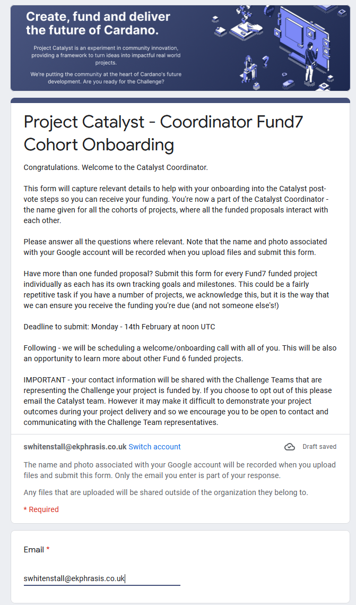

# Fund 7 On-Boarding

## Overview

Proposal : [Community Governance Oversight](https://cardano.ideascale.com/c/idea/383517)

Fund 7 Challenge : [Improve and Grow Auditability Challenge](https://cardano.ideascale.com/c/campaigns/26253/about).

## Cohort On-boarding

### What is your project title as it appears on Ideascale? \*

Community Governance Oversight

### Please provide a link to your Catalyst proposal on Ideascale. \*

[https://cardano.ideascale.com/c/idea/383517](https://cardano.ideascale.com/c/idea/383517)

### What is your primary Ideascale username that published the proposal? \*

@swhitenstall

### Please, provide ONE sentence description of your project that best characterizes its purpose and intent. \*

Survey, report & facilitate retrospectives to improve our governance processes.

### What specific industry does your proposal cater to? \*

All (Audit, Governance & Oversight

### Who are the end users of your proposal project? \*

Everyone, governments, enterprises, etc.

Everyone

### How many members does your team have today? \*

5 to 10

### What is your current planned implementation/delivery date? \*

When do you expect the scope of the proposal to be fully implemented or go live

1st May 2022

### Which challenge were you successful in? \*

Improve and Grow Auditability

### Were you previously successful in any of the past funding rounds? Like Fund1, 2, 3, 4, 5, 6? \*

Yes

### Past Funding

### Which fund did you receive funding from prior to this funding round? (check all that apply) \*

Fund 5 and 6

### Please, provide Ideascale link(s) to your all past funded proposals here. \*

[https://cardano.ideascale.com/c/idea/351678](https://cardano.ideascale.com/c/idea/351678), [https://cardano.ideascale.com/c/idea/369556](https://cardano.ideascale.com/c/idea/369556), [https://cardano.ideascale.com/c/idea/370088](https://cardano.ideascale.com/c/idea/370088), [https://cardano.ideascale.com/c/idea/368678](https://cardano.ideascale.com/c/idea/368678), [https://cardano.ideascale.com/c/idea/366707](https://cardano.ideascale.com/c/idea/366707), [https://cardano.ideascale.com/c/idea/367891](https://cardano.ideascale.com/c/idea/367891), [https://cardano.ideascale.com/c/idea/383492](https://cardano.ideascale.com/c/idea/383492), [https://cardano.ideascale.com/c/idea/383517](https://cardano.ideascale.com/c/idea/383517), [https://cardano.ideascale.com/c/idea/381354](https://cardano.ideascale.com/c/idea/381354), [https://cardano.ideascale.com/c/idea/382330](https://cardano.ideascale.com/c/idea/382330), [https://cardano.ideascale.com/c/idea/382324](https://cardano.ideascale.com/c/idea/382324), [https://cardano.ideascale.com/c/idea/382334](https://cardano.ideascale.com/c/idea/382334)

### Contacts

Please provide contact information so IOG can reach you and your project. First, enter primary contact details and you can add additional people's contacts in the last section if desired. Please, don't include email accounts like info@ team@ admin@ handles as mailing services will not recognize it as a safe e-mail and block delivery of emails. Thank you in advance.

### What is your last name? \*

Whitenstall

### What is your first name? \*

Stephen

### Primary Contact E-mail \*

[swhitenstall@ekphrasis.co.uk](mailto:swhitenstall@ekphrasis.co.uk)

### Provide alternative name(s) & email addresse(s) of key people to contact in your project team and their position. \* \*

This is to ensure of a back in case of unavailability of primary contact.

Hidden

### Please, provide your project's public website URL (if you have one).

[https://quality-assurance-dao.gitbook.io/community-governance-oversight/](https://quality-assurance-dao.gitbook.io/community-governance-oversight/)

### Telegram username \*

Telegram groups are our primary method of communications. Here important updates are announced by Catalyst. On demand support between one another and the Catalyst team is often initiated here. If you don't have a telegram account - kindly create one and provide us with your handle. Thank you in advance.

@swhitenstall

### Discord username

Your discord handle is desirable. If you don't have a discord account - please create one. We will be inviting you to the IOHK's technical communities server. Discord account would be pre-requisite for us to be able to do so. Thank you in advance.

Stephen \[QADAO]\[SWARM]#7396

### Twitter username

This is useful when we publish results or updates regarding Project Catalyst and/or funded projects where we can tag online presentation and help drive traffic and awareness to your projects via twitter community. This is not required but strongly encouraged. Kindly, insert handles of key people or project itself or both. Thank you in advance.

[https://twitter.com/qa\_dao](https://twitter.com/qa\_dao)

### Any other social media channels or contact details - please specify.

### What country or countries are you primarily based in? \* \*

United Kingdom, New Zealand

### Which timezone are you primarily based in? \*

Please provide a timezone based on UTC (e.g UTC+1 or UTC-6 etc)

UTC 0

### Please provide logo(s) for your project or venture if you already have such

These are very useful when presenting your project to the world. It helps Cardano community to remember you easier than just a text.

No files submitted

### Or link to the file location where we can find a high resolution of your logo if available.

### Funding Section

In order to receive funding, a working ada address needs to be supplied and confirmed. This address will be used initially to test validity for further funding. Only after successful confirmation of the test transaction, additional funds may be sent. Funds are not distributed all at once but in batches based on the regular submission of reports on project progress. Only in very exceptional cases this can be re-considered. Proper argumentation needs to be provided for the early fund release. There will also be a requirement of proof of life where you'll need to hop on a call with the Catalyst team with a video camera to help address due diligence. More details will be provided in during the onboarding call. Thank you for your kind understanding.

### Your project's ada payment address \*

Make sure this is a correct address. Triple check it, please!

Hidden

### Catalyst Pathways

Catalyst is committed to adding value to as many projects as possible. We have launched a number of business accelerator and product development programmes that could be relevant to your project. We would encourage you to learn about and make the most of these opportunities while they are available. The benefit to each project going through any of these support programmes helps grow your knowledge, grows your network, brings new perspectives and mentors to your team, and can potentially help with your future investment objectives.

### Which of the following are you interested in participating in?

Please select as many as are relevant to your project

Atala Prism Pioneers Programme: An educational course to support using Atala Prism identity solution

&#x20;
