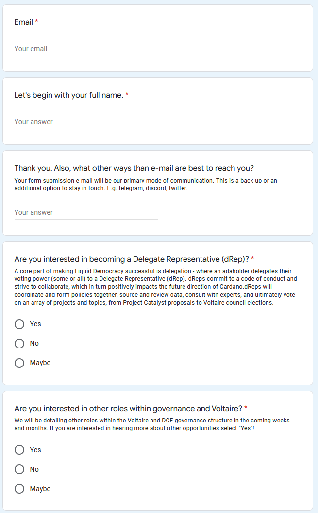

# Delegated Voting (dRep)

## February 2022

### Overview

At the [Town Hall #1 of Fund 8 on 16th February 2022 ](https://catalyst-swarm.gitbook.io/catalyst-swarm-2022/february-2022/catalyst-town-halls-february-2022#16th-february)of Dor presented the dRep (Delegated Representative) Pilot.

[Link to the Slides](https://docs.google.com/presentation/d/1hfpHzhVl0Mu8xrMy5f6fFG0O0iJHx9qIp9kOBrcWNN8/edit?usp=sharing)



### Registration Form

#### Become a dRep - Delegate Representative in Catalyst

[Link to form](https://docs.google.com/forms/d/e/1FAIpQLSfPSb\_cDlIxN6cnnbOrJN\_oxDBmxB3kENbsE\_\_pmMAw8yJk0w/viewform)

.png>)

Today we are welcoming interest to join the first cohort of dReps. This group will play a pivotal role in shaping Cardano's governance, and will work with IOG and others to grow a lively and collaborative team. Joining the cohort will support your future candidacy and dRep profile, and develop your position as future leaders of Cardano. You will have opportunities to share ideas, process improvements, and engage your fellow peers - truly teaming up to define the early stages of governance. As we move through the next few weeks, there will be organized workshops, training, and support on-hand.

One of the aspects we are most excited about is how ada-holders (voters) can share or split their voting power to dReps. This contributes to the collaborative and team essence of delegation. Many, if not all dReps, will have voting power delegated to them from the same ada-holder, stressing the importance of careful deliberation together, and seeking each other's advice as proposal are considered and, ultimately, voted on.

Additionally, delegating voting power does not mean rewards are forfeited, and for those who become dReps, your rewards will factor in the time commitment and dedication the role entails. For transparency, it's a time and community commitment that is considerable and we expect the role to take up a significant part of someone's working life. The incentive model will reflect the importance and time commitment for this responsibility - more on this to come.

To note: delegating voting power to a dRep (or multiple dReps) is always optional and can be recalled after each funding round (as long as it’s before the snapshot deadline). On top of that, ada-holders can split their voting power between themselves and their chosen dRep/s (to maintain freedom to vote directly). Absolute Liquid Democracy is a powerfully flexible structure.

Anyone can be a dRep, and if you are excited about decentralized governance and delegation, register your interest to join the first cohort. Currently, there is one prerequisite to becoming a dRep - you must have voted at least once on a proposal within Project Catalyst, but if you have not voted yet, there is an upcoming opportunity for Fund 8 proposals that will make you eligible. We will share a list of minimum requirements soon, although don't let that put you off registering your interest!

Access to the first dRep cohort will be limited due to onboarding. We will be reviewing all expressions of interest on the 28th February. To register your interest to join the first dRep cohort, please complete this form and we will be in touch in the first week of March with next steps.

Note: This form will require you to submit a motivation letter with a minimum character limit at the end (about 500 words). Please take time and diligence to write a thoughtful submission.

#### Are you interested in becoming a Delegate Representative (dRep)?

A core part of making Liquid Democracy successful is delegation - where an ada holder delegates their voting power (some or all) to a Delegate Representative (dRep). dReps commit to a code of conduct and strive to collaborate, which in turn positively impacts the future direction of Cardano.dReps will coordinate and form policies together, source and review data, consult with experts, and ultimately vote on an array of projects and topics, from Project Catalyst proposals to Voltaire council elections.

.png>)

#### What is your motivation for wanting to be a dRep or involved in Cardano's future governance?

This is your time to write a thoughtful and impactful motivational letter on how you aspire to be a dRep. What drives you, how do you see the role of dRep evolving, and what are you hoping to achieve for Cardano. There is a minimum 500 word limit (2,500 characters). Note: this will remain confidential at this stage and will not be published. Your public facing profile will be created at a later stage.

## March 2022

### Joining the first dRep cohort

.png>)

#### email registration acknowledgement - 17th March 2022

**Hello!**\
\
Thank you for expressing your interest in becoming a dRep - your initial application has been received.

\
We're incredibly excited to get started on this journey and have been overwhelmed with interest so far. Over the coming weeks, we’ll be sending out invites via email to a series of exploratory workshops designed to provide both a deeper insight into the dRep role and offer further support.

\
As we move into delegation, you will play a pivotal role in championing and safeguarding the future of Catalyst and Cardano. So, in the meantime we would encourage you (if you haven’t done so already) to read a recent [blockchain governance paper](https://iohk.us20.list-manage.com/track/click?u=26d3b656ecc43aa6f3063eaed\&id=9201c74d34\&e=6bc8455536) written by two senior IOHK researchers and additionally the initial treasury paper [A Treasury System for Cryptocurrencies: Enabling Better Collaborative Intelligence](https://iohk.us20.list-manage.com/track/click?u=26d3b656ecc43aa6f3063eaed\&id=89ba0125fb\&e=6bc8455536).\
\
More broadly, study on collaboration and communication are always net-positive endeavors. Some recommendations; [The Power of Experiments](https://iohk.us20.list-manage.com/track/click?u=26d3b656ecc43aa6f3063eaed\&id=6e061973b2\&e=6bc8455536), [Reinventing Organizations](https://iohk.us20.list-manage.com/track/click?u=26d3b656ecc43aa6f3063eaed\&id=704b3cda9c\&e=6bc8455536), and [Reinventing Discovery](https://iohk.us20.list-manage.com/track/click?u=26d3b656ecc43aa6f3063eaed\&id=591c208e07\&e=6bc8455536).

\
Stay tuned for the workshop invites!\
\
The Project Catalyst Team

### **d-Reps letter presented to Catalyst Circle**

#### March 3rd 2022



**Joey Chessner** presented an open letter from the Catalyst community to IOG, covering three key issues:

1. Designated Representatives (dReps);
2. Treasury Structure, Control and functionality; and
3. Treasury Transparency.

### **d-Reps letter (**[**link**](https://docs.google.com/document/d/10Naaxx7fH2aL\_8YUFzqMBB8RBlzYLwPE1H3pkU4GgRw/edit?usp=sharing)**)**



## April 2022

### IOG Response to d-Rep letter

[**Link to IOG Response**](https://docs.google.com/document/d/1kD\_iVBZaq5As6O60\_TUqj-0pbm0QIdlSIG\_UF7B\_4kk/edit?usp=sharing)\*\*\*\*



Dear signatories, Circle members, and the entire Cardano community,

Input Output Global, Inc. (IOG) would like to thank you for your coordinated effort to compose [Community Letter to IOG - D-reps & Treasury](https://docs.google.com/document/d/10Naaxx7fH2aL\_8YUFzqMBB8RBlzYLwPE1H3pkU4GgRw/edit?usp=sharing), which has been shared across the organization. It is encouraging to see the level of enthusiasm from the community for Cardano's journey and the roadmap ahead. Yet, IOG acknowledges that some areas might need expansion and a clearer definition on the path forward.

The product team has considered many of the questions and issues raised in the letter, and shared the feedback with IOG's research and engineering teams. The initial approach to Delegated Representatives (dReps) will be in the form of a pilot program, allowing for a degree of experimentation and learning with the first cohort. As the details are being worked out, IOG supports the idea of exploratory workshops to clarify some of the issues and questions you raised, and will be sharing relevant plans soon. We also recognize that, where possible, themes expressed in the letter should be elaborated on, notably the role of a dRep and how absolute liquid democracy will work for Project Catalyst.

dReps will operate wholly within Project Catalyst. IOG, along with many in the Cardano community, understand the critical importance of voter participation, either directly or via delegation, when allocating treasury funds. To increase the validity of Project Catalyst proposals coming through each fund, there is a clear desire to drive voter participation and reduce apathy within the broader ada holder ecosystem. To illustrate this, on average in Fund7, current voting wallets cast ballots on just 8 proposals out of 934. Incorporating delegated democracy and dReps into the core enactment of governance - that of casting a vote - can drive proposal engagement up and strengthen the mandate Project Catalyst has for using Cardano Treasury funds. This also supports greater engagement, allowing the more passive ada holder to contribute without barriers.

The solutions presented in your letter align with IOG's plans. We will collaborate with the first cohort of dReps to shape a code of conduct and, essential for transparency, share updates to the wider Project Catalyst ecosystem. In response to questions and issues regarding the treasury, and taking a similar approach to that of dReps, we agree with your solution and will organize a series of workshops to clarify the structure and inner workings of the treasury.

IOG hugely appreciates the level of thought and consideration invested in the letter, and we are grateful for the feedback. It has given us a greater level of insight into current thinking (and mood in general) among the Catalyst community. This can only support a synergistic relationship going forward.

Delegation and dReps are exciting concepts, and IOG is very much looking forward to bringing all this together with the help of the Cardano community. We are working towards the first cohort of dReps being fully onboarded and operational for voting in Fund9 (mid-July) with future iterations likely in Fund10 and beyond. Invites to workshops and further details will be issued in the coming weeks.

Yours sincerely,

IOG

### Introducing the Concept of Delegate Representatives (dReps)

April 11, 2022 Jack Briggs

#### dReps will vote on the vast majority of proposals within Project Catalyst and enhance the quality of decision making within each Fund



At a recent [Project Catalyst Town Hall](https://www.youtube.com/watch?v=rNZJvzjgduM), IOG announced the concept of delegating your voting power, the role of Delegate Representatives (dReps) and invited those keen to get involved to express an interest. There has been a fantastic response and we’re now excited to share more details.

In less than a year, [Project Catalyst](https://iohk.io/en/blog/posts/2021/02/12/our-million-dollar-baby-project-catalyst) has become the world’s largest decentralized innovation fund. It is a focal point for ongoing development and sustainable innovation, driven by the Cardano community. Fund8 had nearly 1,000 proposals put forward, and Catalyst is now on track to fund over 2,100 proposals during 2022. That is staggering!

This continued expansion of the Cardano ecosystem signals fantastic news for the Cardano community as a whole. However, exponential growth poses a challenge though. As the number of proposals increases, so does the community’s responsibility to both review and vote upon them. To ensure that all proposals gain the attention they deserve, and to facilitate continued growth, a new system is required to ensure sustainability.

Delegation enables ada holders to delegate their voting power to one or many dReps. This allows the more passive voter a chance to continue to have their voice heard, but now across more proposals than they could personally read and evaluate.

These dReps will vote on the vast majority of proposals within Project Catalyst, and in turn will enhance the quality of decision making within each Fund. dReps will coordinate and form policies together, source and review data, consult with experts, and ultimately vote on an array of projects and topics that the community has brought forward.

The introduction of dReps is another exciting step forward as the community continues to learn and grow. There will be more to share and discuss over the weeks and months ahead as we roll out delegation into future Project Catalyst funds. To bolster inclusion and diversity, **IOG is reopening interest** in [joining the first dRep cohort](https://bit.ly/3rSyHvP).

Over the coming weeks, IOG will be organizing a series of workshops that go into greater detail on what it means to be a dRep, the incentive model, and what impact dReps will have on Project Catalyst.

### ADAO Twitterspace

#### April 23rd 2022

ADAO and Quasar held a Twitter space on April 23rd regarding governance and DReps. Good discussion; community seems both excited and apprehensive regarding how DReps will influence governance. Forward information on the Governance Oversight Committee to a couple participants interest in this groups work. - Kenric

## May 2022

## dRep improvement and onboarding

F8: Fund9 challenge setting

**Ideascale link** - [https://cardano.ideascale.com/c/idea/400779](https://cardano.ideascale.com/c/idea/400779)

> How do you achieve "(1) diverse and many dRep participation + (2) easy and proper voter delegation?"

## Rep's Code of Ethics+Bridges Asia

[F8: Community Advisor Improvements](https://cardano.ideascale.com/c/campaigns/26453/stage/stage-governancephase151c10/ideas/unspecified)

**Ideascale link -** [https://cardano.ideascale.com/c/idea/400782](https://cardano.ideascale.com/c/idea/400782)

> a draft of the rules required for dRep and introduce all dRep in Japanese.
