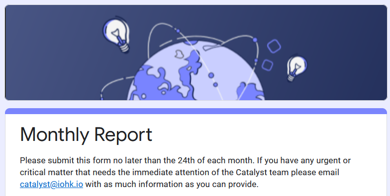

# F7 Monthly Reports

## Overview

Monthly reports are submitted to the Catalyst Team at IOHK.

As of March 2022 they [use this format](https://docs.google.com/forms/d/e/1FAIpQLSdS6wAzKdSR1mAwCHP0EkVqOVlszvU5E45B0G2-0HmjO6qgbA/viewform).

## 24th March 2022

| Field                                                                                                                                                                                                                    | Data                                                                                                                                                                                                                                                                                                                                                                                                                                    |
| ------------------------------------------------------------------------------------------------------------------------------------------------------------------------------------------------------------------------ | --------------------------------------------------------------------------------------------------------------------------------------------------------------------------------------------------------------------------------------------------------------------------------------------------------------------------------------------------------------------------------------------------------------------------------------- |
| **Email**                                                                                                                                                                                                                | Private                                                                                                                                                                                                                                                                                                                                                                                                                                 |
| **Project ID**                                                                                                                                                                                                           | [700075](https://docs.google.com/spreadsheets/d/1bfnWFa94Y7Zj0G7dtpo9W1nAYGovJbswipxiHT4UE3g/edit#gid=793243167\&range=B80)                                                                                                                                                                                                                                                                                                             |
| **Which fund is your challenge in ?**                                                                                                                                                                                    | Fund 7                                                                                                                                                                                                                                                                                                                                                                                                                                  |
| **In which Challenge is your proposal? (one report per project)**                                                                                                                                                        | [F7: Improve and Grow Auditability](https://cardano.ideascale.com/c/campaigns/26253/stage/all/ideas/unspecified)                                                                                                                                                                                                                                                                                                                        |
| **Is the project still in progress / launched / complete ?**                                                                                                                                                             | Still in Progress                                                                                                                                                                                                                                                                                                                                                                                                                       |
| **Is the project on track?**                                                                                                                                                                                             | No                                                                                                                                                                                                                                                                                                                                                                                                                                      |
| **If you answered No to the above question, what are the issues or blockages you are having?**                                                                                                                           | Part of the F7 Proposal Scope "Oversight of the Catalyst Parameters Pilot" has been placed on hold by IOG. See Circle V3 - Meeting 2 Stand-Up by Harris ([https://quality-assurance-dao.gitbook.io/catalyst-circle-oversight-v3/ccv3-meetings/meeting-2-march-17-2022#2.-circle-stand-up-13-44](https://quality-assurance-dao.gitbook.io/catalyst-circle-oversight-v3/ccv3-meetings/meeting-2-march-17-2022#2.-circle-stand-up-13-44)). |
| **What date will you complete your project?**                                                                                                                                                                            | May 26th 2022                                                                                                                                                                                                                                                                                                                                                                                                                           |
| **(Optional) Please share any suitable evidence of progress about your deliverables since last report? This could be documentation, photo or any other measurable way you feel demonstrates the impact of your project** | Added link to CGO Project Management Section in "anything else you would like to share about your project?" below                                                                                                                                                                                                                                                                                                                       |
| **Is there anything else you would like to share about your project?**                                                                                                                                                   | Evidence & information about the progress of this project can be found here - https://quality-assurance-dao.gitbook.io/community-governance-oversight/project-management/overview                                                                                                                                                                                                                                                       |

## 24th April 2022

| Field                                                                                                                                                                                                                    | Data                                                                                                                                                                              |
| ------------------------------------------------------------------------------------------------------------------------------------------------------------------------------------------------------------------------ | --------------------------------------------------------------------------------------------------------------------------------------------------------------------------------- |
| **Email**                                                                                                                                                                                                                | Private                                                                                                                                                                           |
| **Project ID**                                                                                                                                                                                                           | [700075](https://docs.google.com/spreadsheets/d/1bfnWFa94Y7Zj0G7dtpo9W1nAYGovJbswipxiHT4UE3g/edit#gid=793243167\&range=B80)                                                       |
| **Which fund is your challenge in ?**                                                                                                                                                                                    | Fund 7                                                                                                                                                                            |
| **In which Challenge is your proposal? (one report per project)**                                                                                                                                                        | [F7: Improve and Grow Auditability](https://cardano.ideascale.com/c/campaigns/26253/stage/all/ideas/unspecified)                                                                  |
| **Is the project still in progress / launched / complete ?**                                                                                                                                                             | Still in Progress                                                                                                                                                                 |
| **Is the project on track?**                                                                                                                                                                                             | Yes                                                                                                                                                                               |
| **If you answered No to the above question, what are the issues or blockages you are having?**                                                                                                                           | n/a                                                                                                                                                                               |
| **What date will you complete your project?**                                                                                                                                                                            | 15th June 2022                                                                                                                                                                    |
| **How large is your community (social or otherwise) ? We are particularly interested in large, active communities with real people and engagement.**                                                                     | Community Governance Oversight present at Town Halls, provide updates in the IOG newsletter and uploads recordings to QADAO YouTube.                                              |
| **(Optional) Please share any suitable evidence of progress about your deliverables since last report? This could be documentation, photo or any other measurable way you feel demonstrates the impact of your project** | Added link to CGO Project Management Section in "anything else you would like to share about your project?" below                                                                 |
| **Is there anything else you would like to share about your project?**                                                                                                                                                   | Evidence & information about the progress of this project can be found here - https://quality-assurance-dao.gitbook.io/community-governance-oversight/project-management/overview |

#### Notes -

**Project ID** (Project ID is your unique project 6 digit number - you can find it in this document under your fund tab - column B: [https://bit.ly/FundedProjectsReporting](https://www.google.com/url?q=https://bit.ly/FundedProjectsReporting\&sa=D\&source=editors\&ust=1648128976564351\&usg=AOvVaw2pKKT7q6OqeaxJ8r8OIhSQ) \*

**Is the project still in progress / launched / complete ?** - 'Still in progress' means that your funded project is live and ongoing, 'Launched' means you have launched the product, service or app you have developed in your funded project, 'Complete' means you have completed your funded project. If you have completed your project please be sure to submit your End of Project report and video [shorturl.at/mtBZ0](https://www.google.com/url?q=http://shorturl.at/mtBZ0\&sa=D\&source=editors\&ust=1648129856836889\&usg=AOvVaw1q0I6GOqSIqY5MnEXoX1Qx).

.png>)
