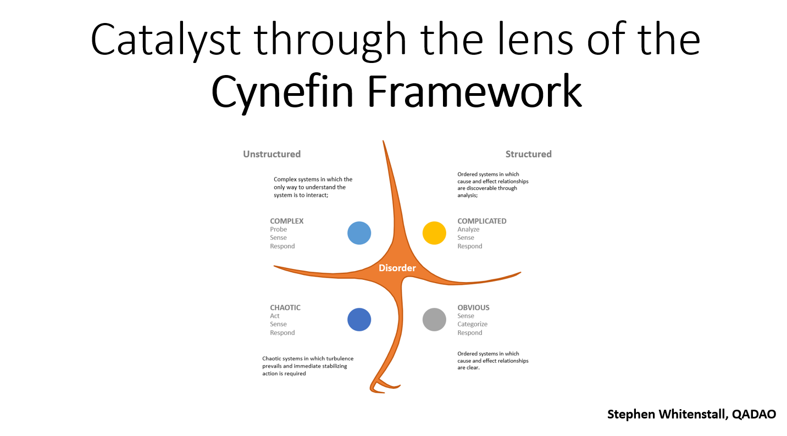

# Catalyst through the lens of the Cynefin Framework

## Introduction

This presentation is the latest of a series of community research initiatives in support of the F7 Community Governance Oversight Proposal.&#x20;

Previous events have covered Antifragile Success criteria & How to nurture a listening culture in Catalyst ? And today we will look at oversight of Catalyst parameter changes through the lens of the Cynefin Framework.

The Cynefin Framework is a conceptual framework used to aid decision-making. It was created in 1999 by Dave Snowden when he worked for IBM Global Services. Cynefin is a Welsh word that can be translated as habitat but its meaning extends to the domains we live in and the places you come from.

## Cynefin Overview

.png>)

In this slide I will give an overview of the Cynefin Framework & then on the next slide apply this to Catalyst.

The Cynefin Framework seeks to locate systems in domains or spaces defined by causal relationships.

These domains are divided into structured versus unstructured systems.

In total there are 5 domains as follows:

On the right-hand side are Structured domains which include

### The Obvious

.png>)

Here live ordered systems with clear cause, and effect relationships.

In this situation it is appropriate to

Sense - establish the facts

Categorize –

Respond – by following the rule or appropriate best practice

Obvious approaches are standard operating procedures such as completing a form or requiring a field be completed on Ideascale.

### The Complicated

 (1).png>)

Here live ordered systems whose cause, and effect relationships are discoverable through analysis.

In this situation it is appropriate to

Analyze – assess the facts

Categorize –

Respond – apply the appropriate good operating practice

Complicated approaches are where it is possible to rationally work towards a decision, but this requires research and technical expertise.

Moving to the left-hand side – here are Unstructured domains which include

### The Complex

.png>)

Here complex systems live, where the only way to understand the system is to interact with phenomena.

In this situation it is appropriate to

Probe the situation

Sense what is occurring

And respond

With Complex approaches cause and effect can only be deduced in retrospect, there are no right answers. Rather instructive patterns emerge from sensemaking.

### The Chaotic

.png>)

Here live chaotic systems where turbulence prevails, and immediate stabilizing action is required.

In this situation it is appropriate to

Act to establish order

Sense where stability lies

And respond to turn the chaotic into the complex

In Chaotic situations cause and effect are unclear, but it is essential to act. So, a series of ad hoc actions may occur simply to establish order and restore some stability.

### Disorder&#x20;

.png>)

Finally in the center is the domain of disorder which can also be seen as a starting point. Here lives a cacophony of voices jostling for prominence – this situation is what assignment to the other domains or spaces seeks to resolve.

## Cynefin Framework and Catalyst

.png>)

So how might all this relate to what we do in Catalyst?&#x20;

Returning to the domains

### The Obvious

.png>)

Here the IOG Catalyst Team & the Catalyst community routinely apply straightforward solutions such as KPI reports, surveys, quantitative retrospectives & reports.

These standard operating procedures help support the day to day running of Catalyst and are essential to provide continuity of information.

A danger with the Obvious domain is complacency where standard procedures start to drift away from their intended purpose.

### The Complicated

.png>)

Here the IOG Catalyst research Team, the Technical Council & Catalyst Community academic research conduct in-depth analysis and research into discrete solutions

### The Complex

.png>)

Here the Catalyst community, Catalyst Circle & IOG Catalyst Team innovate through the Catalyst experiment. This is an iterative process which probes for ideas, senses what is occurring and responds with community innovation.

This is where the complex systems of distributed governance emerge and the only way to understand what is going on is to interact with the experiment.&#x20;

### The Chaotic

.png>)

Here the Catalyst community, Catalyst Circle & IOG Catalyst Team react to unforeseen events that cause turbulence or instability in the Catalyst experiment.

A recent example is the filtered-out CA assessments where urgent action was needed to establish reliable assessment scores. The vCA community acted spontaneously to sense how stability could be restored. And their response turned the chaos back into the complex domain of governance. Where decentralized voting could now proceed.

### Disorder

In Cardano this is where many newcomers find themselves. It is the latent potential to move to a space where they can realize their contribution. Guiding stars such as Quasar sometimes appear to guide people on their journey.

## Catalyst Parameters – Governance Process

.png>)

&#x20;\
&#x20;

